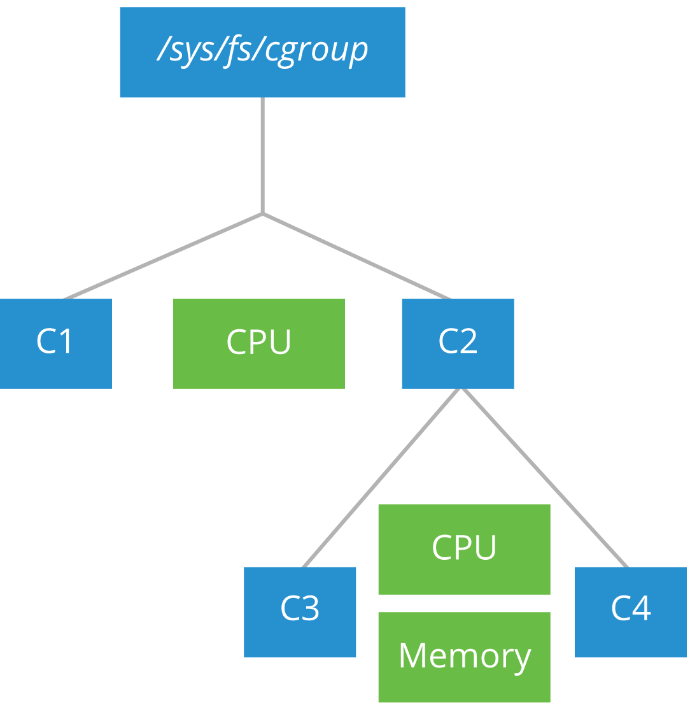
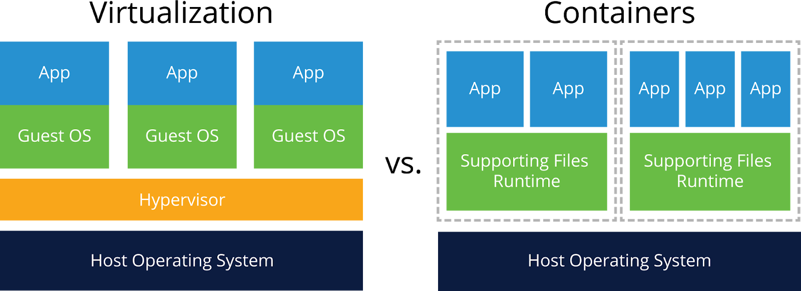

# Containers Fundamentals

## Virtualization Fundamentals

### Control Groups (cgroups)

**Control groups**, known as cgroups, are a feature of the Linux kernel allowing the limitation, accounting, and isolation of resources used by groups of processes and their subgroups.

### Namespaces

**Namespaces** are a feature of the Linux kernel allowing groups of processes to have limited visibility of the host system resources.

### Unification File System (UnionFS)

**UnionFS** is a feature found in the Linux, FreeBSD and NetBSD kernels, allowing the overlay of separate transparent file systems to produce an apparent single unified file system.

## Virtualization Mechanisms

### Full Virtualization vs. Operating System-Level Virtualization

Although Containers are not considered to be Virtual Machines (VMs), not even light-weight VMs, their similarities cannot be overlooked.  

A Virtual Machine is created on top of a hypervisor software. A typical application runs inside such a VM, and it requires extensive overhead to reach the physical hardware or the outside world considering that it has to go through so many layers of abstraction - the guest OS, then the hypervisor, and finally the host OS.

A container is a light-weight environment that virtualizes and isolates resources for a running application. A container allows an application to be boxed and shipped with all its dependencies. Once deployed, a container runs directly on the host operating system. As a result, the user space component of the container should be compatible with the host operating system

### Operating System-Level Virtualization

### Mechanisms Implementing Operating System-Level Virtualization

### Chroot

### FreeBSD Jails

### Solaris Zones

### OpenVZ

### Linux Containers (LXC)

### Systemd-nspawn

## Container Standards and Runtimes

## Image Operations

## Container Operations

## Building Container Images

## Container Networking

## Container Storage

## Course Completion
