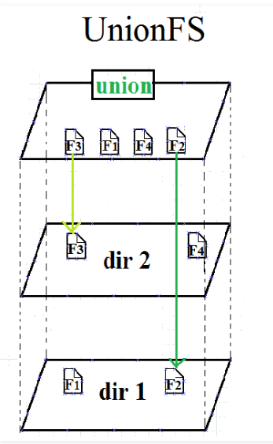

# Containers Fundamentals

## Virtualization Fundamentals

### Control Groups (cgroups)

**Control groups**, known as cgroups, are a feature of the Linux kernel allowing the limitation, accounting, and isolation of resources used by groups of processes and their subgroups.

### Namespaces

**Namespaces** are a feature of the Linux kernel allowing groups of processes to have limited visibility of the host system resources.

### Unification File System (UnionFS)

**UnionFS** is a feature found in the Linux, FreeBSD and NetBSD kernels, allowing the overlay of separate transparent file systems to produce an apparent single unified file system.

## Virtualization Mechanisms

### Full Virtualization vs. Operating System-Level Virtualization

Although Containers are not considered to be Virtual Machines (VMs), not even light-weight VMs, their similarities cannot be overlooked.  

A Virtual Machine is created on top of a hypervisor software. A typical application runs inside such a VM, and it requires extensive overhead to reach the physical hardware or the outside world considering that it has to go through so many layers of abstraction - the guest OS, then the hypervisor, and finally the host OS.

A container is a light-weight environment that virtualizes and isolates resources for a running application. A container allows an application to be boxed and shipped with all its dependencies. Once deployed, a container runs directly on the host operating system. As a result, the user space component of the container should be compatible with the host operating system

### Operating System-Level Virtualization

Operating system-level virtualization refers to a kernel’s capability to allow the creation and existence of multiple isolated virtual environments on the same host.  
As opposed to programs running inside a real environment, where they see all resources such as CPU, network, connected devices, and files, programs running inside a virtual environment are limited to its content and assigned devices.  
Operating System level virtualization is typically used to limit usage and securely isolate resources shared between multiple programs or users, and to separate programs to run in their own assigned virtual environments for better security and resource management.  
While Operating System level virtualization requires less overhead than full virtualization because everything is managed at the kernel level without the need to install a guest OS, it limits the OS of the virtual environments to the host Operating System.  

### Mechanisms Implementing Operating System-Level Virtualization

While one of the first known mechanisms to implement operating system-level virtualization dates from the early 1980s, the majority of such mechanisms known today were released after the turn of the 21st century

### Chroot

Chroot is a mechanism implementing OS-level virtualization. It was first introduced on UNIX Version 7 in 1979, then in 1982 it was added to BSD.  
Any user process and/or its children running inside this virtual chrooted directory tree runs under the false impression that it is in the real root directory tree of the operating system.  

### FreeBSD Jails

A FreeBSD jail is a mechanism implementing OS-level virtualization with very little overhead. It was first introduced in 2000 on FreeBSD systems.  
FreeBSD jail allows for the partitioning of a FreeBSD system into many independent systems, called jails. They share the same kernel, but virtualize the system’s files and resources for improved security and administration through clean isolation between services.  
Jails become virtual environments running on the host system with virtualized filesystem, processes, and users.  
Jails share the host kernel instead.

### Solaris Zones

Solaris zone is a mechanism implementing OS-level virtualization. It was first introduced in 2004 on Solaris 10 systems.  
Solaris zones represent securely isolated Virtual Machines on a single host system. Zones may host single or multiple applications, services, and their children. Each zone on a host system virtualizes its hostname, network, IP address, and it has assigned storage.

### OpenVZ

OpenVZ is a mechanism implementing OS-level virtualization; it was first introduced in 2005 on Linux systems.  
OpenVZ allows a physical host to run multiple isolated virtual instances - called containers, virtual environments or virtual private servers. OpenVZ containers share the same kernel, and can only run Linux.

### Linux Containers (LXC)

LXC, or Linux Containers, is a mechanism implementing OS-level virtualization; it was first introduced in 2008 on Linux systems.  
LXC allows multiple isolated systems to run on a single Linux host, using chroot and cgroups, together with namespace isolation features of the Linux kernel to limit resources, set priorities, and isolate processes, the filesystem, network and users from the host operating system.

### Systemd-nspawn

Systemd-nspawn is a mechanism implementing OS-level virtualization; it was first introduced in 2010 on Linux systems.  
Systemd-nspawn may be used to run a simple script or boot an entire Linux-like operating system in a container.

## Container Standards and Runtimes

## Image Operations

## Container Operations

## Building Container Images

## Container Networking

## Container Storage

## Course Completion
